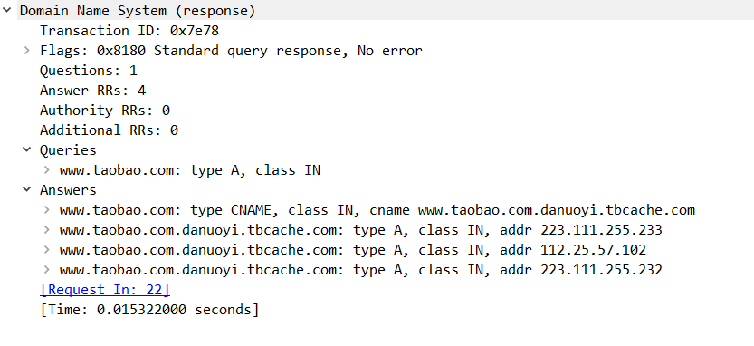
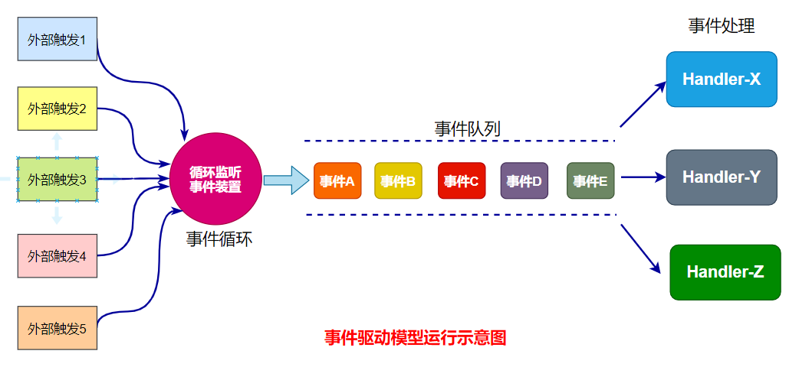

[TOC]

# My-HPLSP

## 1. 协议总览

各个协议所处的位置：


TCP/IP协议栈对上层数据的封装：


我们需要掌握的网络协议包括如下几个：①**应用层上的HTTP和DNS协议**；②**传输层上的TCP和UDP协议**；③**网络层上的IP协议**；④**数据链路层上的ARP协议**。还需要知道它们是**如何协作完成网络通信的，及其过程**。


## 2. 常见协议

### 2.1 ARP协议

ARP首部（外部封装了以太网帧首部但不包括尾部），固定长度28字节：


如下是一个实际ARP请求报文内部详细的内容：


如下是一个实际的ARP应答报文内部详细的内容：


### 2.2 DNS协议

DNS消息中的内部结构大致如下，长度未定：


其中上面6个部分是必然存在的，而下面4个部分取决于这个DNS报文的类型。若是查询报文，则只有查询问题区域；若是应答报文，则会有查询问题区域和回答问题区域存在，其他可能存在也可能不存在。

其中查询问题的格式如下：


而回答问题（其中内含的正是资源记录RR）的格式如下：


如下是一个实际的DNS查询报文中的内容（具体问题中的内容不展开）：


如下是一个上述DNS查询报文的应答报文中的内容（具体问题中的内容不展开）：




### 2.3 IPv4协议

#### 2.3.1 IPv4首部

IPv4固定首部大小20字节，其格式如下：


下面展示了一个实际IP数据报首部中的内容：


#### 2.3.2 IPv4分片

当IP数据报的长度超过了当前输出设备路径的最大传输单元MTU（以太网帧的MTU为1500字节，这意味着IP数据报中实际只能承载1500-20-20=1460字节的应用层数据），那么此时就会发生IP分片。其结果就是分片后的n个IP数据报（此时被称为IP分组）中除了最后一个IP分组之外都会被标记MF标志，以表示后续还有别的IP分组属于同一IP数据报，同时每一个IP分组中的13位片偏移都被得到相应的设置。下面展示了两个由一个IP数据报分片之后得到的IP分组：


### 2.4 IPv6协议

Ipv6固定首部大小40字节，其具体格式如下：


由于我所处的网络没有IPv6，所以我也就不展示了


### 2.5 TCP协议

#### 2.5.1 TCP首部


比较需要注意是如下两点：

1. **32位确认号**由如右公式进行推导：

   $TCP确认号=上一个接收到的TCP分节序号+TCP分节实际数据长度=下一个期望受道的TCP分节序号$

   其中比较特殊的是：虽然SYN同步分节和FIN终止分节（报文段）携带的数据长度都为0，但是它们都有占用一个序号值，也就是说它们都被当作数据长度为1的TCP分节

2. **4位头部长度**用来指出当前TCP首部具有多少个4字节，最大位15表示TCP首部最大的长度是$15\times4bytes=60bytes$。当该数为n时，但实际上TCP首部不需要记录$n\times4bytes$的数据量，那么TCP会对选项字段中进行填充（因为这种情况只会在需要选项字段的时候发生）

3. 6个常见的标志需要熟悉：USG紧急标志、ACK确认标志、PSH催促标志（要求对方应用程序赶紧从接收缓冲区中取走数据，意味着后续还会有许多数据到来）、RST复位标志（异常情况）、SYN同步标志和FIN结束标志。


对于**选项字段**其基本结构有如下几种选项方式构成：


最前面的字段kind决定了选项的意义和作用：

1. kind为0表示结束；
2. kind为1表示空操作用来填充；
3. kind为2表示最大报文段长度MSS选项；
4. kind为3表示窗口扩大因子，它是一个移位数。当移位数非0，则表示发送方实际的接收窗口长度为$16位窗口大小指出的值\times2^{窗口扩大因子}$；
5. kind为4表示支持、允许选择性确认SACK选项；
6. kind为5表示用于SACK实际工作的选项；
7. kind为8表示时间戳选项

如下是一个实际的TCP首部信息（包含了选项字段）：


#### 2.5.2 TCP状态转移

如下是TCP的状态转移图：


其中需要我们关心的几个状态是：①**半关闭状态（写半部关）**，即FIN_WAIT_2；②**TIME_WAIT状态**；③**半打开状态**（这是一种异常的状态。一个常见的例子是客户端仍然保持连接，但服务器却由于某些异常原因早就将连接关闭，此时只有客户端傻傻地认为连接仍然存在。若服务器重启，此时客户端向对端发送数据则会收到RST报文段；若服务器主机一直处于崩溃状态，则要么就是返回超时错误要么就是由中间某一个路由器发送会一个ICMP错误导致返回主机不可达错误）。


#### 2.5.3 TCP拥塞控制

TCP拥塞控制有如下几个阶段：①慢启动、②拥塞避免、③快速重传和④快速恢复。


#### 2.5.4  TCP拥塞控制与接收窗口

在下面我们将实际展示TCP是如何通过返回给对方的确认ACK报文段来影响对方（客户端）数据的发送：


在上图中，服务器的套接字接收缓冲区被设置为2304字节，客户的发送缓冲区大小被设置为4608字节，但实际上TCP服务器在自己的SYN同步报文段中指出自己仅有1152字节大小（接收缓冲区的一半）的接收窗口大小，窗口扩充因子为0。

即使如此，TCP服务器也并没有按照这个服务器的接收窗口大小的指示在第一次发送1152字节大小的TCP报文段给服务器，而是只发送了1152/2=576字节大小的数据。这致使TCP客户端向其发送了两个字节大小为576字节的TCP报文段（序号101、103），服务器接收后其接收窗口满，但应用进程立即取走了这些信息，所以服务器并没有回复win=0的ACK报文段。但后面的两个报文段（序号106、107和再后面的110、111）就没有这么幸运了，服务器接收到这些数据后，其接收窗口立即变满，且应用进程没有在ACK报文段发送之前的一段时间内取走这些数据，因而导致服务器所在主机内核中TCP协议栈发送了一个win=0的确认报文段，以告知客户端暂时先不要发送数据。直到后来服务器应用程序取走了这些数据之后TCP才再发送了一个win>0的确认报文段给客户端，此时客户端才被允许向对方发送数据。


## 3. 高性能服务器程序框架

### 3.1 服务器编程框架

最基本的服务器框架由3个基本模块和1个可选模块组成：

|        模块名        |                     模块作用                     |
| :------------------: | :----------------------------------------------: |
|     I/O处理单元      |            处理客户连接，读写网络数据            |
|       逻辑单元       |        负责业务逻辑的工作线程或者工作进程        |
|       请求队列       | 各个单元之间的请求方法，甚至如其名就是真正的队列 |
| 网络存储单元（可选） |                  文件/数据库等                   |


在早先UNP书籍上的服务器代码上我们就接触过这种编程范式：①主线程监听、接受客户请求；②然后主线程将accept返回得到的连接套接字加入到一个FIFO队列之中，并通过互斥量进行保护；③最后线程池中的各个线程通过抢占的方式从队列中取出套接字描述符，然后为客户提供服务。在这里工作线程不仅提供业务逻辑上的处理，而且数据的接收/发送也是由工作线程完成的。

在上面的描述的服务器中主线程就是最典型的I/O处理单元，而工作线程就是逻辑单元，FIFO队列就是我们所述的请求队列，通过这个队列连结沟通I/O处理单元和逻辑单元，以实现协调工作。


### 3.2 ==两种高效的事务处理模式==

#### 3.2.1 事件与事件驱动模型

##### 3.2.1.1 事件与I/O复用

**事件，一言以蔽之，其本质就是状态的变化**。主要的事件包括3种：①I/O事件（细分有读事件，例如套接字缓冲区接收到新的数据；写事件，例如套接字缓冲区有足够的空间容纳新的发送数据；以及异常事件等）；②信号事件；③定时器事件。下图仅仅展示了I/O事件发生时的情况：


由于这些系统事件的发生具有随机性和异步性的特点，如果仅仅通过不断轮询的方式来检查某些事件是否发生（例如通过while循环+非阻塞I/O的方式不断检测连接套接字上是否有接收到新的数据），那么我们可以预料这种是一种非常低效的手段，因为I/O事件发生的概率很小，进程大多数的事件都会花在无意义的事情上，且重复多次调用I/O函数还会涉及到系统调用带来的性能开销。因此我们会使用I/O复用函数来替代上述低效率的方式。

I/O复用（函数）的作用就是应用进程向内核注册我们感兴趣的I/O事件，让内核来帮助我们对它们进行检测（内核也可能使用轮询的方式进行检测事件的发生与否，但总之它的效率会比我们在应用进程中实现高效的多）。当内核发现注册的感兴趣事件发生了，那么I/O复用函数就会从内核返回，通知进程哪些事件发生了。在后面我们可以了解到I/O复用函数不仅可以帮助我们检测I/O事件，而且还可以通过统一事件源的方式让I/O复用函数通知信号事件、定时器事件的发生与否。总而言之，I/O复用的作用就是事件通知，其所利用的思想接近于设计模式中学习到的好莱坞原则：`Don't call us, we'll call you`


>  在早先的理解中，我常常搞不清楚I/O复用与reactor模式之间的关系，一度以为reactor模式就是借了I/O复用函数的壳罢了，也没有搞清楚reactor模式中任务的分发和I/O复用存在怎样具体的关联等等。
>
> 就我目前的理解，I/O复用的作用如上所述就是事件通知。当事件被通知之后，事件模型（以reactor为例）中的reactor线程就会使用dispatcher分发器传递给某一个工作者线程，而后者使用与注册事件关联的事件处理器并执行回调函数。这个回调函数的职责就是处理客户请求数据的分析、计算、处理等逻辑操作。在这样的服务器中，dispatcher分发器就是整个网络服务器架构中的一个模块，而I/O复用仅仅就是dispatcher所利用到的一种技术罢了。


##### 3.2.1.2 网络框架和事件驱动模型

在谈到事件驱动模型之前，我们需要明确下在网络服务器中我们必须面对的几个问题，或者说是服务器的主要责任负担。其中最主要的包括如下3个操作：

- **事件的检测**，主要是I/O事件；
- **数据的读写**；
- **请求数据的分析和处理**；


一个好的网络服务器模型应该是各个模块、每个线程各司其职，不会发生责任不平衡或者某一个模块出现责任过重的现象。

###### 3.2.1.2.1  基于线程的模型

基于线程的模型是早期网络服务器开发或者我们之前学习经常接触到的一种简单网络服务器模型。在这种模型中，主线程仅仅负责新连接的接受，当其接收到新的连接之后就会创建出一个临时的线程来处理这个网络请求。这种模型与我们理想中的服务器模型相去甚远：数据的读写、请求的分析和处理（事件的检测可能不太有）基本上都是由工作线程负责，且这种每一个客户每一个临时线程模式还增加了线程创建、线程上下文切换等性能开销，因此在实际的编程中很少采用这种模式。其工作图示如下：


###### 3.2.1.2.2  事件驱动模型

事件驱动模型与上面基于线程的模型是一种接然不同的网络服务器模型。在这种模型中，程序的执行流完全由外部的系统事件来驱动，且相比于基于线程模型很好的实现了连接接受和事件处理的责任分离。它的特点是有一个循环监听事件装置执行一个**事件循环**，当外部事件发生时会使用**回调**机制来触发相应的**事件处理**（这个执行事件循环的线程必然是异步线程）。



上图展示了这种事件驱动模型的大致结构。在这种模型中，大致由事件循环装置、解多路复用器、事件队列以及事件处理器构成。其大致的执行流程就是循环监听事件装置使用解多路复用器来监听各种各样的事件源，当有部分事件发生时就会启用自己dispatcher的作用将事件对象放入到一个事件队列中，最后另一个工作线程或者当前线程从事件队列中获取事件调用事件处理器中的回调函数执行针对性的处理操作。


#### 3.2.2 Reactor模式

Reactor（反应堆）模式，是一种常见事件驱动模式。这种由事件通知驱动程序流执行的程序最大的一个特点就是主线程中的反应器会监听并通知I/O准备事件，然后将这些事件由自己调用回调函数或者交由一个工作线程执行回调函数对它们进行处理。而后面的Proactor模式的不同之处在于主线程中的反应器通知的是I/O完成事件，因此采用Reactor模式的服务器在应用进程层面有一个I/O读写的负担，而Proactor没有，所以理论上Proactor具有更好的性能表现。

Reactor模式可以根据I/O操作、CPU操作具体由谁执行以及执行事件循环线程的数量、工作线程的存在方式分成如下3种：

1. 单Reactor线程模式
2. 单Reactor线程+工作线程池模式
3. 多Reactor线程+工作线程池模式


##### 3.2.2.1 Reactor基本组件和执行流程

不管Reactor按照上面的说法有着怎样的实现方式，在Reactor模型中都会存在如下几个重要的部件，且相互之间存在着如下UML类图指出的关联：


- **事件源**：该组件在UML类图中是以Handle句柄的形式进行展现，对于I/O事件我们很容易联想到它本质就是文件描述符，而对于其他的事件需要通过统一事件源的方式间接转换成文件描述符或者以特殊的数值进行记录（例如在libevent中定时器的句柄就是-1）。
- **解多路复用器Demultiplexer**：该组件的本质就是对像select、poll、epoll这样的I/O复用函数的封装类，负责监听各种系统事件，然后通知应用进程。
- **事件处理器Event Handler**：当事件发生的时候，我们可以直接或者间接的方式调用事件处理器上的回调函数执行相应的逻辑操作（可能是read-decode-compute-encode-write，当然在有些实现中没有read和write两个步骤），同时它还提供了返回句柄的功能（每一个事件处理器都应该和一个句柄进行绑定）。
- **反应器Reactor**：该组件的作用就是向解多路复用器Demultiplexer注册或者删除系统事件，并负责在事件发生（由上面的解多路复用器通知）时执行事件任务的分发，很有可能它会将事件通过事件队列分发给某一个工作线程，让它来执行事件处理器上的回调函数（或者也可能在反应器所在的线程上直接事件处理器上的回调函数）。


上面绘制的时序图是[reactor.pdf](book/reactor.pdf)中提到的一个reactor实例的时序图，我们将其借鉴到这里来描述采用Reactor模式的网络服务器的大致执行流程：

1. 在程序的一开始，服务器会执行初始化创建出一个**Reactor反应器**类对象（也即是分发器Dispatcher）；
2. 服务器创建初始化监听套接字，然后将其描述符（句柄）封装成Accept-Event事件（I/O读事件）注册到Reactor内部使用到的**Event Demultiplexer解多路复用器**（内核维护的epoll感兴趣事件表）中，以要求内核在该监听套接字上发生读事件的时候通知应用进程。这个过程正对应着上面的①；
3. 然后服务器调用Reactor反应器中的`handle_events()`操作，它内部有一个无限循环；
4. 当一个新的连接到来时，解多路复用器（内部`epoll_wait()`）返回。此时Reactor就会将事件分发给某一个工作线程（或者在单Reactor模式下就是由当前线程），让它调用回调函数完成相应的请求分析处理操作。这个过程正对应上面的②；
5. 当Acceptor事件处理器的回调函数接受了一个新的连接后，它需要将连接套接字描述符封装成一个I/O读事件（可能还有异常事件），然后将其注册到Event Demultiplexer中，以要求内核在接收到客户发送过来的数据时通知应用进程。这个过程正对应着上面的③；
6. Acceptor事件处理完后就没有什么事件需要处理了，此时Reactor反应器就会开始下一次的事件循环等待下一个事件的发生；
7. 当内核TCP接收到来自客户发送过来的数据之后，解多路复用器就会返回。此时Reactor就会将事件发送给某一个工作线程（...），让它调用I/O事件处理器的回调函数读入数据到应用进程缓冲区中。然后就有可能发生新一轮的事件注册-返回-等待-返回的过程...


##### 3.2.2.2 单Reactor线程模式

单Reactor线程模式是一种最简单的Reactor模式，在这种模式中，上述网络服务器3大责任（事件监听、数据读写、逻辑处理）负担都由一个线程来全部完成。其大致结构如下：


> 其中上面的Acceptor是一个针对监听套接字的事件处理器，而event Channels就是上面所讲的需要事件循环监听的事件源，而分发器由Reactor反应器这个组件来完成，在单Reator线程模式中Reactor实际上没有分发的过程，即它没有将事件对象放入事件队列，而是直接调用事件处理器上的回调函数进行处理。

下面展示了一个最基本的实现：

```c++
#include "MyUNP.h"
#include <iostream>
#include <unordered_map>


//解多路复用器
class Event_Demultiplexer {
public:
	Event_Demultiplexer():
		epfd(epoll_create(5)){}
	~Event_Demultiplexer() { close(epfd); }

	int register_event(struct epoll_event& ev) {
		return epoll_ctl(epfd, EPOLL_CTL_ADD, ev.data.fd, &ev);
	}

	int remove_event(int fd) {
		return epoll_ctl(epfd, EPOLL_CTL_DEL, fd, NULL);
	}

	template<int max_events>
	int wait(std::array<struct epoll_event, max_events>& event_arr,int timeout) {
		return epoll_wait(epfd, event_arr.data(), max_events, timeout);
	}

private:
	int epfd;
};


//事件处理器，这里并没有采用继承的方式实现
class Event_Handler {
public:
	using callback_type = void(*)(int);

	Event_Handler(int fd,callback_type cb):
		eventfd(fd),callback(cb){}
	virtual ~Event_Handler() = default;

	int get_handle() const { return eventfd; }
    /* 其实这里可以传入一个Reactor指针或者引用，这样我们就可以以
    	继承+派生类覆写实现这个（虚）成员函数了。但事件处理器怎么销毁？ */
	void handle_event() { callback(eventfd); }

protected:
	int eventfd;
	callback_type callback;
};


//反应器
class Reactor {
public:
	
	void register_handler(Event_Handler* handler) {
		struct epoll_event ev;
		ev.data.fd = handler->get_handle();
		ev.events = EPOLLIN | EPOLLET;
		demultiplexer.register_event(ev);
		handlers[ev.data.fd] = handler;
	}


	void remove_handler(int fd) {
		demultiplexer.remove_event(fd);
		auto handler = handlers[fd];
		handlers.erase(fd);
		delete handler;
	}

	void handle_events() {
		std::array<struct epoll_event, 10> event_arrs;
		for (;;) {
			int nret = demultiplexer.wait<10>(event_arrs, -1);
			
			for (int i = 0; i < nret; ++i) {
				//分发处理。对于多线程而言应该会有一个发送到请求队列的过程
				handlers[event_arrs[i].data.fd]->handle_event();
			}
		}
	}
	
private:
	Event_Demultiplexer demultiplexer;
	std::unordered_map<int, Event_Handler*> handlers;
};


static Reactor reactor;

//I/O事件的回调函数
void callback_func(int sockfd) {
	char buf[MBUFSIZE];
	ssize_t nread;

	while ((nread = read(sockfd, buf, sizeof(buf) - 1)) > 0) {
		buf[nread] = 0;
		std::cout << "get " << nread << " bytes data \"" << buf <<
			"\" from fd " << sockfd << std::endl;
	}
	if (nread == 0 || (nread == -1 && errno != EWOULDBLOCK)) {
		reactor.remove_handler(sockfd);
		close(sockfd);
		std::cout << currtime("%T") << ": connection of fd " <<
			sockfd << " has been closed" << std::endl;
	}
}

//监听套接字的回调函数
void accept_func(int listenfd) {
	struct sockaddr_in cliaddr;
	socklen_t clilen = sizeof(cliaddr);
	int connfd = accept(listenfd, reinterpret_cast<struct sockaddr*>(&cliaddr), &clilen);
	std::cout << currtime("%T") << ": new connection from " <<
		sock_ntop(reinterpret_cast<const struct sockaddr*>(&cliaddr), clilen) << std::endl;
	reactor.register_handler(new Event_Handler(connfd, callback_func));	
}


int main(int argc, char* argv[])
{
	if (argc != 2)
		err_quit("usage: %s <serv/port>", basename(argv[0]));

	int listenfd = tcp_listen(NULL, argv[1], NULL);
	Event_Handler* acceptor = new Event_Handler(listenfd, accept_func);
	reactor.register_handler(acceptor);
	reactor.handle_events();
}
```


##### 3.2.2.3 单Reactor+工作线程池模式

由于上述的单Reactor线程模式的所有工作都在一个线程上完成，因此这种实现方式的实时处理能力和效率都不是很高。一种我们能够想象得到的解决方法就是使用单Reactor+工作线程池模式，让线程池中的多个工作线程来负责客户请求的分析计算等处理，而Reactor线程负责事件的监听和数据的读写（这种实现方式我感觉类似于《*Linux高性能服务器*》提到的用同步方法实现Proactor模式）。当然我认为单Reactor+工作线程池模式的另一种实现应该是线程池中的工作线程不仅负责客户请求的分析处理，还需要需要让工作线程负责数据的读写，而Reactor线程仅仅负责事件的监听。

这两种方式的不同之处在于前者的主线程负责事件监听和数据读写两个大任务，工作线程纯粹的负责逻辑处理；而后者主线程仅负责事件的监听，工作线程负责数据的读写和逻辑处理这两个任务。但无论是哪一种方式，我们都可以预料到数据的读写在整个服务器运行的过程中都是一个很大的负担，但从整体视角来看，前者实现的方式更纯粹，此时的工作线程更像是一个逻辑单元，不会去做一些乱七八糟的事情。下图展示的就是第一种模式：


##### 3.2.2.4 多Reactor+工作线程池模式

但单Reactor+工作线程池模式也存在一个不足之处，那就是Reactor（主）线程负担了太多的责任。当服务器连接的客户数量达到一定程度时，这一个线程不仅需要背负事件监听的任务，还需要为之完成数据读写的任务，由于完成客户请求的逻辑分析操作所需要的时间往往远小于数据的读写操作，因此这种单Reactor+工作线程池的模型仍然会遇到不小的性能瓶颈。

解决的方法就是产生更多的Reactor线程，让它们各自分担事件监听的责任，这样Reactor反应器的压力就会小很多。一种常见的实现方式就是让进程产生多个Reactor线程，其中main-Reactor线程负责新连接的接受，并在接受到新的连接后就将关乎这个套接字的I/O事件注册到sub-Reactor线程的监听事件源中；而sub-Reactor线程负责除连接接受外的系统事件的监听，以及具体数据的读写，并且会在读写之后将相关的事件交给工作线程中的事件处理器去处理。这样就可以大大提高服务器执行的性能和效率了，具体如下图所示：


>  参考资料：
>
> 1. [深入理解Reactor 网络编程模型](https://zhuanlan.zhihu.com/p/93612337)
> 2. [高性能IO模型分析-Reactor模式和Proactor模式（二）](https://zhuanlan.zhihu.com/p/95662364)
> 3. [深入理解Linux高性能网络架构那些事](https://mp.weixin.qq.com/s/5QMfkclFc_UrbLHr1-Fymg)
> 4. [reactor.pdf](book/reactor.pdf)


#### 3.2.3 Proactor模式

如上面所述，在Reator模式中的事件循环装置向Reactor反应器通知的是I/O准备事件，然后再让具体的某一线程去执行相关的处理操作。而Proactor向内核注册的是I/O完成事件并让内核只在相关读写完成的时候通知自己。这样应用进程层面就不再需要顾及太多的数据读写操作，完全交由内核去执行，此时网络服务器最重要的两个任务就只剩下事件监听和客户请求的逻辑分析处理。

在实际采用的Proactor模式服务器中，事件的监听一般交由Proactor（主）线程来完成，它只要在相关I/O事件发生的时候调用aio_read()/aio_write()交给内核去处理读写操作即可；而当数据读写完成时Linux的异步I/O（aio）机制就会触发信号处理处理程序（由aiocb控制块设置），这个信号处理程序选择线程池中某一个工作线程来处理客户请求。在这种模式中，各个服务器模块的非常清晰，几乎就是我们想象中那种各司其职的境界，因此其理论性能也非常优秀。其UML类图和总体结构如下所示：


> Proactor模式我理解还不够深刻，这部分内容需要斟酌。


### 3.3 ==两种高效的并发模式==

事件驱动模型中的Reactor、Proactor的本质就是网络编程中的“设计模式”，它定义了服务器中的组件、职责和各部件之间的工作逻辑。而并发模式是定义各个组件应该在何种类型的线程上运行、协调的方式。

并发模式指的是I/O处理单元和多个逻辑单元之间协调处理任务的方法，其中包括①半同步/半异步模式、②半同步/半反应堆模式、③半同步/半反应堆模式的改进版、④领导者/追随者模式等。


> https://mp.weixin.qq.com/s/QEwN8ww3o-y8hV2r9jcvYQ讲的蛮好的。
>
> C10k问题：http://www.kegel.com/c10k.html#related


#### 3.3.1  半同步/半异步模式

这里的“同步”和“异步”的概念需要和I/O模型中的同名概念进行区别。**并发模式中的“同步”指的是程序完全按照代码序列顺序执行，而“异步”指的是程序的执行需要有系统事件来驱动**。而I/O模型中的同名概念的核心在于内核通知的I/O完成事件还是就绪事件。例如同一个读操作，在同步线程中直接调用read即可，而在异步线程中可能就需要信号事件来驱动，只有当该线程接收到信号并执行信号处理程序才会调用read函数。

我们这里所述应用于服务器编程的半同步/半异步模式，它必须依赖于内核的异步I/O机制（但Linux对异步I/O的支持并不是很理想）。其中主线程是异步线程，当其监听到有一个I/O读事件的时候它就会使用异步I/O机制让内核执行数据的读取。完成后，异步线程就会将这些数据封装成一个请求对象，并放入请求队列中。而在另一方面，工作线程会以同步方式运行。一旦请求队列中有了一个请求对象，其中一个工作线程就会从中取出这个请求对象并施以逻辑处理。


#### 3.3.2  半同步/半反应堆模式

半同步/半反应堆模式是对半同步/半异步模式的另类替代。在半同步/半异步模式中，主线程以异步的方式执行，工作线程以同步的方式执行，但由于Linux上的异步I/O机制有所缺陷，所以出现了半同步/半反应堆模式。在半同步/半反应堆模式中，主线程以异步的方式进行运行（虽然I/O多路复用本质上是同步I/O），而工作线程以同步的方式执行，由于epoll返回时通知的是I/O就绪事件，所以工作线程需要自己读写数据，所以被称之为半反应堆。如果我们让只主线程epoll返回后先自己读取数据，然后将数据和fd封装成请求对象加入到请求队列中，那么工作线程就不需要读写数据，这其实是在模拟Proactor模式。


由于Linux对异步I/O的支持并不是很理想，因此我们常常使用epoll等多路复用机制来模拟出主线程异步的过程（虽然epoll等本质上也是同步的）。其中一种便是半同步/半反应堆模式。

在这种模式中，主线程就是唯一的异步线程，它会使用epoll等I/O多路复用机制来实现对事件的监控，这种监控不仅是针对连接请求事件还包括对已连接套接字上事件的监控。若连接请求达到，这主线程会执行接受操作并将生成的连接套接字描述符也加入监控的范围。若已连接套接字上发生了某些事件，则主线程会将描述符fd（而不是半同步/半异步中的数据）封装成请求对象加入到请求队列中。然后由某一个工作线程从中获得这个描述符并加以处理。如下图所示：


上述图中展示的半同步/半反应堆模式采用的是Reactor模式，因为它要求工作线程自己负责从套接字上读取数据并处理，然后发送请求结果给客户，这也正是半反应堆half-reactive的由来。在事实上，半同步/半反应堆模式也是可以采用Proactor模式，即通过让主线程负责数据的读写，而不是让工作线程自己来完成。


#### 3.3.3 半同步/半反应堆模式改进版

半同步/半反应堆模式的缺点在于主线程的监听任务过于繁重，它不仅需要对连接请求事件进行监听，还需要对已连接套接字上的各种事件进行监听，进而导致了客户越多请求队列加/解锁的次数不断递增等各种问题。

而在半同步/半反应堆模式的改进版本中，主线程不再负责已连接套接字上的事件监听，而是直接将连接套接字分发给某一个工作线程，让工作线程能够同时对多个已连接套接字进行监听，自己却只负责连接请求事件的监听。这样的好处在于①主线程的负担减小；②请求队列上的加/解锁次数减少，因为此时服务器并不再需要为每一个I/O事件而重复将描述符放入到请求队列中；③工作线程可以为多个客户上的事件进行监控并处理。


#### 3.3.4  领导者/追随者模式

与半同步/半异步模式中异步线程监控套接字上的事件、同步线程处理具体的客户请求的情况相反，领导者/追随者模式是让多个工作线程轮流获得事件源集合，轮流监控、分发并处理事件。在任何一个时间点，程序仅有有一个领导者线程，它负责监听I/O事件，而其他线程都是追随者，它们休眠在线程池中等待成为新的领导者。若当前的领导者检测到I/O事件，它首先会从线程池中推选出新的领导者线程，然后处理I/O事件。此时，新的领导者线程等待新的I/O事件，而原来的领导者线程处理I/O事件，从而实现并发。


### 3.4 有限状态机

在前面讨论的事务处理模式和并发模式中，我们的关注点在于如何实现在I/O处理单元、请求队列和逻辑单元之间实现职责的分工和相互协调。而有限状态机这种编程方式的目的在于如何高效的实现服务器中逻辑单元、或者说是宽泛的指如何操纵工作线程的大致逻辑流程走向。

在逻辑单元编程中，前一个步骤和后一个步骤往往具有一定的关联，或者说前后的状态并非独立，因此逻辑单元或者工作线程在执行的过程中前一个状态必然会影响到下一个状态的运作与否，或者说它会影响到下一步执行哪一个流程，将会处于哪一个状态。我们常常将这种具有关联的前后步骤流程编写成有限状态机的模式，至于其模样，就是一些循环+if-else或者switch-case罢了。下面展示了带有状态转移的有限状态机：

```c
STATE_MACHINE() {
	State curstat = type_A;
    
	while (curstat != type_C) {
		rd_data2buf();
		switch (curstat) {
			case type_A:
				/* ... */
				curstat = type_B;
				break;
			case type_C:
				/* ... */
				curstat = type_C;
				break;
			default:
				/* ... */
		}
	}
}
```

例如在HTTP头部消息解析的过程中，常常需要其中不同的行进行不同的处理。但前提是首先需要从HTTP报文中读取出一行一行的数据，而读取的状态无非只有两种：①未读取完毕；②成功读取；③读取有误。若是未读取完毕，那么可能因为缓冲区不够，我们只要继续读取HTTP报文数据到缓冲区就可以了；若是读取成功，那么我们就可以分析其中的字段，若已经分析过HTTP的请求字段，那么我们现在就应该分析普通的头部字段；若读取有误，则返回一个失败的状态，可能会有外面的函数进行处理向客户发送诸如4xx Bad Request这样的HTTP报文。因此我们就可以从上面的例子中HTTP的字段解析大致具如下的状态转移图：


你会发现不仅在读取一行HTTP报文字段上逻辑单元有着不同的状态之外，而且在成功读取之后也有着不同的状态选择（进入分析请求行的状态还是进入分析普通行的状态等）。也就是说逻辑单元很有可能具有多个主次状态机，因此我们在编程中可能就会出现多个while+if-else/switch-case框架。下面展示了分析HTTP一行函数的大致结构：

```c
read_state parse_content(){
    读取HTTP行状态 = OK;
    当前HTTP分析状态 = 还未分析HTTP请求行;
    
    while(read_a_line() == OK){
        switch(当前HTTP分析状态){
            case 还未分析请求行:
                parse_request_line();
                当前HTTP分析状态 = 已经分析过HTTP请求行;
                break;
            case 已经分析过HTTP请求行:
                ret = parse_header_line();
                if(ret == 分析完毕)
                  	return 分析完毕;
        }
    }
    if(未能完全读取一行)
        return 还未读完需要继续从套接字中读取数据;
    return 读取有误;
}
```


## 4. 系统事件

### 4.1 I/O复用

### 4.2 信号

#### 4.2.1 统一事件源

同一事件源的原理其实很简单，就是先让进程创建一个全局可访问的管道，然后当信号递交的时候进入信号处理程序，该信号处理程序仅仅将信号的编码值写入到上述管道中，然后退出。这样I/O复用函数就可以以监听管道读端的方式将信号事件转换成为I/O事件。

 

#### 4.2.2 网络编程相关信号

- SIGHUP：主要是用来给一些后台守护进程发送这个信号时，要求它们重新读取配置文件；
- SIGPIPE：向一个接收到RST分节的套接字（其实已经被关闭）写数据；
- SIGURG：有带外数据到来


### 4.3 定时器

#### 4.3.1 定时方式

Linux主要提供了如下3种定时方式：

1. **使用套接字选项SO_RCVTIMEO和SO_SNDTIMEO**。不过这种方法仅限于套接字，但对于网络编程而言足够了；
2. **使用SIGALRM信号**。不过使用信号可能会增加代码量；
3. **使用I/O函数提供的定时功能**。

一般来说第一个方法几乎只用在套接字数据的发送和接收（read、recv、write、send...以及accept和connect这样两个套接字函数）上面，在其他的使用方面用途有限。而且我们这里所指的定时一般主要用在对非活动连接（长时间不处于数据传输状态的连接）等方面的定时，所以套接字选项SO_RCVTIMEO和SO_SNDTIMEO的能力在这里无处施展。它的主要用途主要还是局限在非阻塞I/O、非阻塞connect，而非阻塞accept几乎很少用到。


#### 4.3.1 升序定时器链表


#### 4.3.2 时间轮（定时器哈希表）


#### 4.3.3 时间堆


## 5. libevent高性能网络框架库

参考资料：

>https://segmentfault.com/a/1190000005594871
>
>https://segmentfault.com/a/1190000005601925
>
>https://segmentfault.com/a/1190000005867855
>
>http://www.wangafu.net/~nickm/libevent-book/


## 6. 程序示例

### 6.1 一个使用共享存储的群聊服务器


